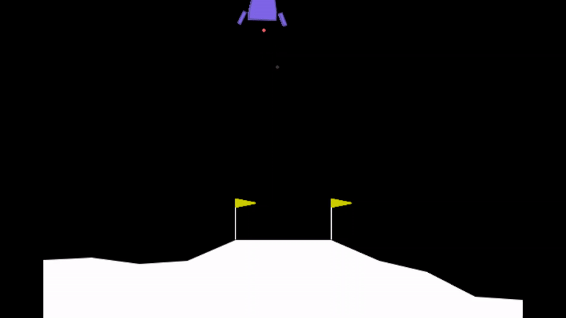
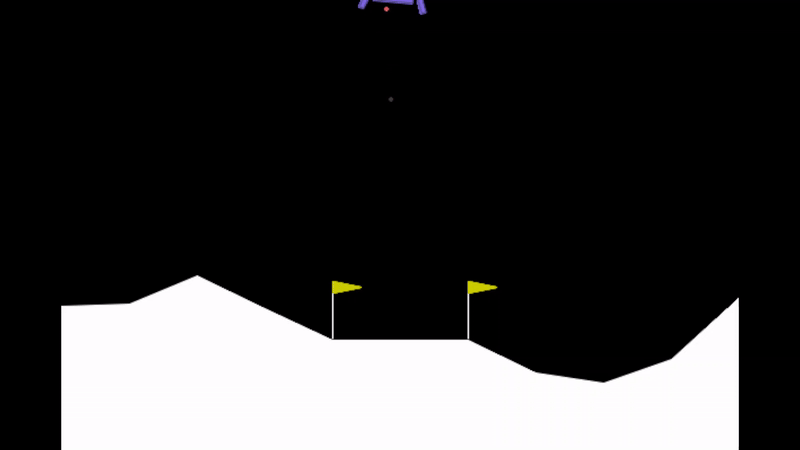

# Lunar-Lander-Reinforcement-Learning

This project has been implemented with the gymnasium Framework: [https://gymnasium.farama.org/environments/atari/freeway/](https://gymnasium.farama.org/environments/box2d/lunar_lander/)

<table>
  <tr>
    <th>Successful Try</th>
    <th>Bad Try</th>
  </tr>
  <tr>
    <td></td>
    <td></td>
  </tr>
</table>

# Setup Instructions

1. **Clone the Repository**:
    ```bash
    git clone [https://github.com/JanMuehlnikel/Atari-Freeway-Reinforcement-Learning](https://github.com/JanMuehlnikel/Lunar-Lander-Reinforcement-Learning)
    cd your-repo
    ```

2. **Create and Activate a New Conda Environment**:
    ```bash
    conda create --name LunarEnv python=3.10
    conda activate LunarEnv

3. **Install `pip` in the New Conda Environment**:
    ```bash
    conda install pip
    ```

4. **Install Packages from `requirements.txt`**:
    ```bash
    pip install -r requirements.txt
    ```
